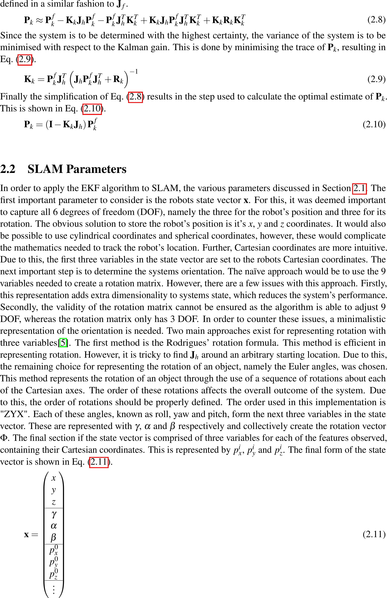

# EKF-Slam

> Extended Kalman Filter SLAM implemented from first principals

This repo implements EKF-Slam from first principals.

---

## Table of Contents (Optional)

- [Installation](#installation)
- [Usage](#usage)
- [Documentation](#documentation)
- [Disclamer](#disclamer)

---

## Installation

- Install python
- Install various depencancies such as numpy ( requirements.txt to come )
- Run the code

## Usage

1) The CreateAssociationsFiles.sh can be run to generate association files needed for the EKF Slam algorithm. This assumes ros with RGBD_DATASET_TOOLS is installed Furthermore, it assumes that the dataset is put into the correct directory.
2) The EKF slam can be built with cmake This file depends on the following:
	Boost, OpenCV, PCL, ROS with ROSBAG and catkin and EIGEN3
3) The CreateORBSLAMAssociations.sh file can be run to create the ORB associations.
4) The createGTPlots.py in plotTrajectory can be used to create the ground-truth plots and estimate the speed of the robot.
5) the createSummaryPlots.py can be used to create the summary plots
6) the CreateTestPlots.py can be used to create the plots generated for each algorithm
7) the CreateConfPlots.py can be used with the EKFSLAMGENCOV in order to generate the covariance plots.

## Documentation

---

## Disclamer

This repository is for educational purposes only. The algorithms implemented here is my interpretation of the original authors' work. Due to this, they will most likely not produce the same results as the original implementations. All rights are reserved to the original authors of the papers this code was based on. 

